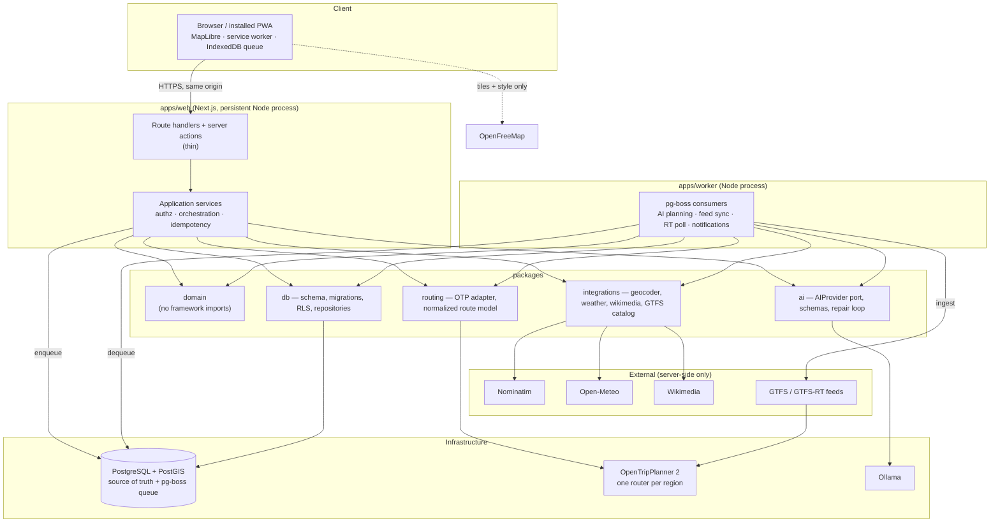
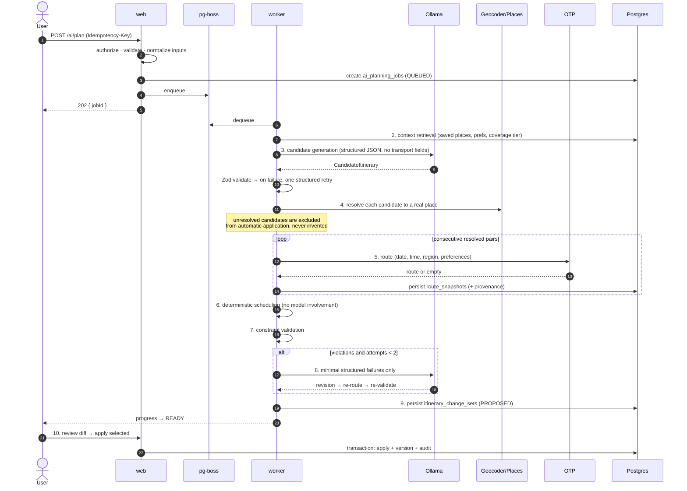
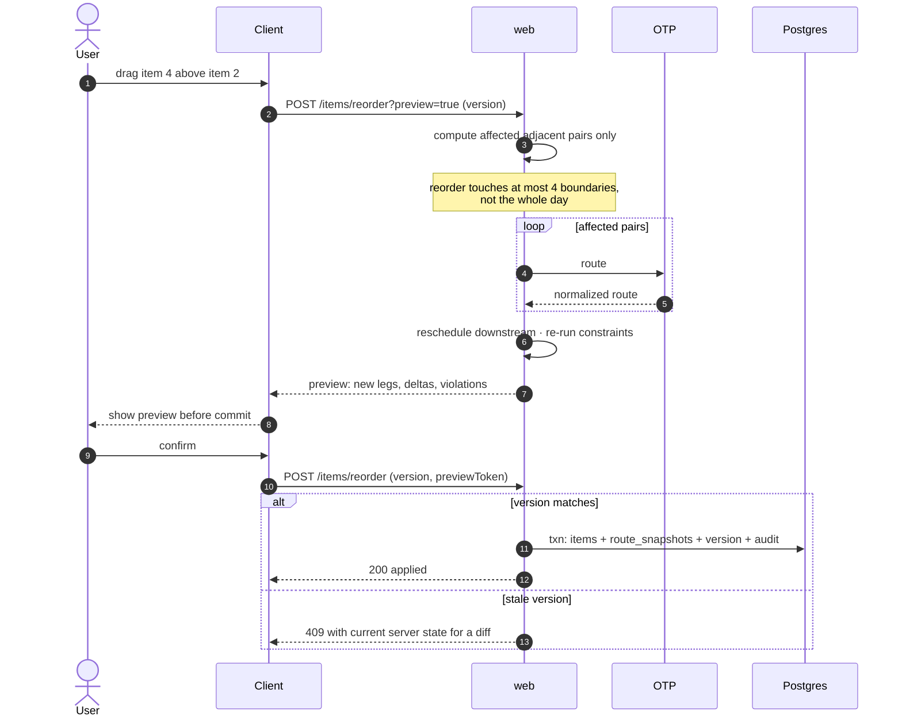

# System architecture

**Status:** Phase 0 · 2026-08-19

## 1. Shape

A modular monolith (`apps/web`) plus one worker (`apps/worker`), sharing typed packages, over
PostgreSQL/PostGIS. Infrastructure services are separate containers because they are separate
products (ADR-0001).



**The one client exception.** The browser talks to exactly one third party: the tile and style
endpoint, which is designed for browser use. Everything else is same-origin (ADR-0010).

## 2. Dependency rule

```
apps/web ─┐
          ├─→ application services ─→ domain ←─ (nothing)
apps/worker ┘                    └─→ ports ←─ adapters (db, ai, routing, integrations)
```

`packages/domain` imports no framework, no HTTP client, no ORM, no React. It defines entities,
policies, the constraint engine and the scheduler, and it declares ports as interfaces. Adapters
implement them. This is enforced by an ESLint import-boundary rule in CI, not by convention — a
violation fails the build.

Route handlers are thin: parse and validate input, resolve the actor, call one application service,
map the result to a response. No domain logic, no direct database access.

## 3. Package responsibilities

| Package | Owns | Must not |
| --- | --- | --- |
| `domain` | Entities, itinerary rules, constraint engine, deterministic scheduler, authorization policy, time arithmetic, money arithmetic | Import any framework, ORM, HTTP client or React |
| `db` | Drizzle schema, SQL migrations, RLS policies, repositories, transaction helper | Contain business rules |
| `routing` | `RoutingProvider` port, OTP GraphQL adapter, normalized route model, region resolution | Leak an OTP payload shape upward |
| `ai` | `AIProvider` port, Ollama adapter, `FakeAIProvider`, prompt construction, Zod schemas, repair loop, tool boundary | Emit or accept transport facts (ADR-0005) |
| `integrations` | Geocoder, weather, Wikimedia, GTFS catalog adapters; SSRF-safe HTTP client; rate limiter; cache | Be called from the browser |
| `ui` | Design tokens, primitives, map components | Contain trip business rules |
| `config` | Zod-validated environment config; fails startup loudly | Read `process.env` anywhere else |
| `test-utils` | Fixtures, database harness, fake providers, factories | Ship to production |

## 4. The routing boundary — where honesty is enforced

`NormalizedRoute` is the only route shape the domain and UI ever see. Fields absent from the
provider response are **absent**, not defaulted.

```ts
type DataStatus = 'REALTIME' | 'SCHEDULED' | 'ESTIMATED' | 'MANUAL' | 'STALE' | 'UNAVAILABLE'

interface Provenance {
  routerRegion: string
  feeds: { feedId: string; feedVersion: string; agency: string; licence: string }[]
  retrievedAt: string        // ISO instant, UTC
  status: DataStatus
}

interface NormalizedRoute {
  id: string
  provenance: Provenance
  totalDurationSeconds: number
  startTime: string; endTime: string   // instants
  transferCount: number
  walkDistanceMeters: number
  geometry: GeoJSON.LineString
  legs: RouteLeg[]
  accessibility?: { wheelchairAccessible: boolean; confidence: 'FEED' | 'INFERRED' | 'UNKNOWN' }
}

type RouteLeg =
  | { kind: 'WALK'; distanceMeters: number; durationSeconds: number; geometry: GeoJSON.LineString }
  | { kind: 'CYCLE' | 'DRIVE'; distanceMeters: number; durationSeconds: number; geometry: GeoJSON.LineString }
  | {
      kind: 'TRANSIT'
      agency: string
      mode: 'BUS' | 'RAIL' | 'SUBWAY' | 'TRAM' | 'FERRY' | 'CABLE' | 'OTHER'
      routeShortName?: string          // absent if the feed omits it
      routeLongName?: string
      routeColor?: string
      headsign?: string
      boardStop: { name: string; code?: string; platform?: string; coord: [number, number] }
      alightStop: { name: string; code?: string; platform?: string; coord: [number, number] }
      intermediateStopCount: number
      scheduled: { departure: string; arrival: string }
      realtime?: { departure: string; arrival: string; delaySeconds: number }
      alerts?: { header: string; description?: string; effect: string }[]
      geometry: GeoJSON.LineString
    }
```

Three rules the type system enforces:

1. `realtime` is optional. There is no default. A UI that wants to show a live badge must
   narrow on its presence, so "pretend scheduled is live" is not expressible.
2. `platform` and `code` are optional. Absent means the feed did not say. The UI omits the row.
3. `Provenance` is not optional anywhere. A route without provenance cannot be constructed.

## 5. Sequence: AI planning

Ten stages, matching the master prompt's pipeline. Note where the model appears — and where it
does not.



Stages 4, 5, 6 and 7 are where correctness comes from. The model participates in 3 and 8 only, and
in 8 it sees only the minimal structured failures — not the itinerary, not the user's data.

## 6. Sequence: reorder a day, reroute only what changed



Preview-before-commit means conflicts are seen before they are created, not after.

## 7. Sequence: realtime status derivation

```mermaid
sequenceDiagram
  autonumber
  participant K as worker (poller)
  participant F as GTFS-RT feed
  participant D as Postgres
  participant W as web
  actor U as User

  loop per feed, per interval
    K->>F: fetch
    alt success
      F-->>K: payload
      K->>D: update transit_feed_versions.last_success_at
    else failure or silence
      K->>D: record failure; last_success_at unchanged
    end
  end

  U->>W: open Today view
  W->>D: read snapshot + feed health
  W->>W: status = REALTIME only if<br/>now - last_success_at < freshnessWindow
  W-->>U: badge + retrievedAt
```

Status is **derived on read**, never stored as a label. A feed that goes quiet flips the badge to
`STALE` with no new data arriving and no code path executing — which is exactly the property R-15
needs.

## 8. Cross-cutting

**Configuration.** One Zod schema in `packages/config`. `process.env` is read in exactly one file.
Invalid or missing required configuration fails startup with a message naming the variable. Secrets
never reach `NEXT_PUBLIC_*`; a CI check greps for the prefix against the secret list.

**Idempotency.** Key + request fingerprint + stored response (ADR-0016). Same key + same
fingerprint replays the response; same key + different fingerprint is a conflict.

**Transactions and the outbox.** Anything with an external effect (notification, invitation email)
writes an `outbox_events` row inside the same transaction as its state change. The worker drains
the outbox. No dual-write between the database and an external system.

**Caching.** Per-provider TTLs reflecting real freshness semantics: geocoding long, weather short,
routes governed by departure time and feed version rather than by clock TTL alone.
Stale-while-revalidate is used only where the UI displays freshness honestly.

**Errors.** Stable machine-readable codes plus a safe human message (`17-ERROR-CODES.md`). No
stack traces, no provider payloads, no secrets in responses. Correlation ID on every response.

**Observability.** OpenTelemetry-compatible structured logs with a correlation ID threaded from
request through job through provider call. Locally this writes to stdout — no vendor, no cost.
Details in `27-OBSERVABILITY.md`.
