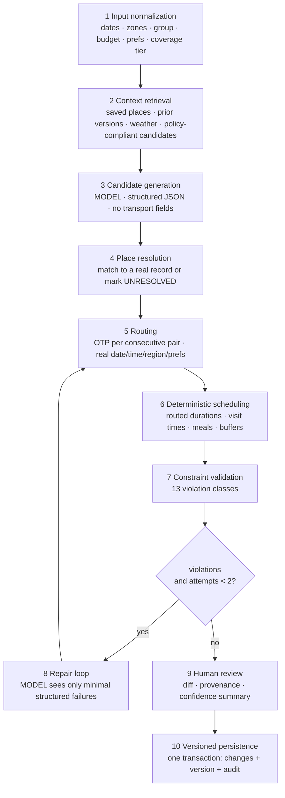

# AI itinerary generation and verification workflow

**Status:** Phase 0 · 2026-08-19 · governed by ADR-0005

## 1. The premise

The model never writes the itinerary. It proposes candidate activities; deterministic services turn
candidates into a schedule. This is not a safety wrapper bolted onto a generative feature — it is the
architecture, and it exists because the failure it prevents is a person boarding the wrong train in
a country whose language they do not read.

A verified 2026-08-19 finding makes this sharper than it looks. Ollama's structured output is
**best-effort, not guaranteed**: the documentation recommends also grounding the schema in the prompt
and setting temperature to 0, and describes no hard validation guarantee
(`08-PROVIDER-MATRIX.md` §2.9). So Zod validation and the repair loop are load-bearing, not
defensive extras.

## 2. What the model may and may not emit

```ts
const CandidateActivity = z.object({
  name: z.string().min(1).max(120),
  rationale: z.string().max(400),
  desiredWindow: z.object({ earliest: z.string(), latest: z.string() }).optional(),
  estimatedDurationSeconds: z.number().int().positive().max(86_400),
  priority: z.enum(['MUST', 'PREFERRED', 'OPTIONAL']),
  uncertainty: z.enum(['LOW', 'MEDIUM', 'HIGH']),
  // no route, no stop, no time, no fare, no platform, no operator, no URL
})
```

The schema has **no transport fields and no URL field**. An injection payload instructing the model
to emit a bus number produces a validation failure, not a rendered lie. The strongest control here is
that the dangerous output is *inexpressible*, so it does not depend on the model behaving.

## 3. The ten stages



The model appears at stages **3 and 8 only**. Stages 4–7 are where correctness comes from.

### Stage 1 — Input normalization
Validate destinations, dates, time zones, group, budget, preferences, fixed events. Resolve each
destination's coverage tier. **A T0/T1 region is told to the planner**, so it does not propose
transit-dependent structures where no transit data exists.

### Stage 2 — Context retrieval
Only policy-compliant sources: saved places, existing trip data, prior versions, weather where
relevant, and place candidates from approved regional data. No unbounded Overpass or bulk Nominatim
querying (ADR-0011).

### Stage 3 — Candidate generation
The one generative step. Structured JSON, temperature 0, schema repeated in-prompt (BR-AI9). Zod
parse; on failure, **one** structured retry carrying the validation errors; then `AI_INVALID_OUTPUT`.
Never a regex over prose.

### Stage 4 — Place resolution
Every candidate must match a real `places` record — by source ID first, then spatial proximity plus
name similarity. **Unmatched candidates become `UNRESOLVED` and are excluded from automatic
application.** They are shown to the user, unchecked and unappliable. Showing them is honest;
applying them would be fabrication.

### Stage 5 — Routing
Real routing calls between consecutive resolved items, using the actual local date and time, the
resolved region and the user's mode and accessibility preferences. Each result persists as an
immutable `route_snapshots` row with full provenance. No leg is ever assumed.

### Stage 6 — Deterministic scheduling
Arithmetic only — no model involvement. Consumes routed durations, visit durations, meal windows,
opening-hour confidence, buffers and locked items. This is where times come from.

### Stage 7 — Constraint validation
Thirteen violation classes (`17-ERROR-CODES.md`). Note that `ACCESSIBILITY_UNKNOWN` is deliberately
distinct from `ACCESSIBILITY_UNSATISFIED`: "the feed does not say" and "there is no accessible route"
are different statements, and conflating them fails persona P7.

### Stage 8 — Repair loop
At most two attempts. The model receives **only the minimal structured failures** — not the
itinerary, not the user's data:

```jsonc
{ "violations": [
  { "code": "MAX_WALK_EXCEEDED", "dayOrdinal": 2, "excessMeters": 340 },
  { "code": "PLACE_CLOSED", "itemRef": "c3", "arrival": "17:40", "closes": "17:00" } ] }
```

Every revision is re-routed and re-validated. A repair that introduces a new violation is still a
failure.

### Stage 9 — Human review
Diff with per-change selection, unresolved candidates, unmet constraints, and a confidence summary
(`routedLegs` / `estimatedLegs` / `unavailableLegs`). Destructive changes are never applied without
this step.

### Stage 10 — Versioned persistence
One transaction: apply selected changes, write the new version, record snapshot references, write
the audit event. Partial application is impossible.

## 4. Progress reporting that cannot lie

The job exposes stage names and real counters, never a synthetic progress bar and never
chain-of-thought:

```jsonc
{ "status": "RUNNING", "stage": "ROUTING",
  "progress": { "routedLegs": 6, "totalLegs": 9 },
  "sourcesChecked": [ { "provider": "OTP", "calls": 6 }, { "provider": "NOMINATIM", "calls": 4 } ] }
```

`sourcesChecked` is **projected from `ai_tool_events` rows**. The claim is a read of what happened,
so it cannot be made unless the call occurred (BR-T9).

## 5. Tool boundary

Four read-only tools. None writes, none fetches a URL, none sends mail.

| Tool | Authorization |
| --- | --- |
| `searchPlaces(query, bbox)` | Rate-limited via the global limiter |
| `getSavedPlaces(tripId)` | Session actor must be a member |
| `getTripContext(tripId)` | Session actor must be a member |
| `getWeather(coord, date)` | None needed |

Each re-validates input with Zod and re-checks authorization **against the session actor**, never
against an identifier the model supplied. A denial is recorded in `ai_tool_events` and alerted on as
a security signal (`27-OBSERVABILITY.md` §7).

## 6. Prompt-injection defence

Untrusted text — OSM descriptions, notes, collaborator content, filenames, provider strings — is
inserted inside explicit delimiters, labelled as data, in a separate channel from system rules and
user intent. Never concatenated into instructions.

Defence in depth, strongest first:

1. **Inexpressible.** The output schema has no transport or URL field, so the worst outcome of a
   successful injection is a bad *suggestion*, which then fails stage 4.
2. **Small typed tool surface.** Nothing that writes or fetches.
3. **Re-authorization inside every tool**, against the session actor.
4. **Channel separation** in prompt construction.
5. **Minimisation and redaction** before every call.
6. **Output validation** with one bounded retry.

## 7. Failure modes and what the user sees

| Failure | Handling | User sees |
| --- | --- | --- |
| Model unreachable | Fail fast, no retry storm | `AI_UNAVAILABLE` — "Your trip is unaffected" |
| Invalid JSON / schema mismatch | One structured retry, then stop | `AI_INVALID_OUTPUT` — try a simpler request |
| Repair exhausted | Return unmet violations | `AI_REPAIR_EXHAUSTED` with what blocked it |
| Some places unresolved | Proceed with the rest | Shown, unchecked, unappliable |
| Some legs unroutable | Proceed with the rest | Dotted stroke, inline fallbacks |
| Router down mid-job | Partial results retained | Partial plan + explicit gap |
| User cancels | Valid partial results kept | Cancelled state |
| Change set stale on apply | Reject | `CHANGE_SET_EXPIRED` — regenerate |

Failing with an explanation always beats succeeding with an invention.

## 8. Determinism and testability

`FakeAIProvider` returns fixture responses, so **CI runs the entire AI suite with no model present
and no paid API** (ADR-0013). Prompts, schemas and the repair loop are versioned, making a model
change an observable, testable event rather than a silent behavioural shift.

The hard gate for Phase 5 is an adversarial suite: fixtures that emit invented bus numbers, invented
platforms, injection payloads in place descriptions and notes, and attempts at cross-trip tool
access. **A single fabricated transport fact reaching render fails the phase**, regardless of
everything else working.
