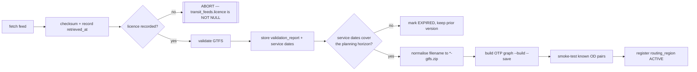

# OpenTripPlanner, GTFS and GTFS-Realtime integration design

**Status:** Phase 0 · 2026-08-19 · all OTP facts verified from official documentation on that date

## 1. Verified platform facts

| Property | Verified value | Consequence for us |
| --- | --- | --- |
| Version | 2.8.1 released (2.9 on master) | Pin the image digest |
| Java | "compatible with Java 25 or later"; Java 25 recommended (LTS) | No host JDK needed — we use the container |
| Memory | ~1 GB minimum for a moderate dataset; `-Xmx2G` recommended | Dominant infrastructure cost, **per resident region** |
| Inputs | OSM PBF extract + GTFS `.zip` whose **filename must contain `gtfs`** | Fetch script normalises to `<operator>-gtfs.zip` |
| Build/serve | `--build --save`, then `--load --serve` | Build once, reuse across restarts |
| Port | 8080 default | Compose maps it; `OTP_BASE_URL` config |
| Container | `opentripplanner/opentripplanner`; data at `/var/opentripplanner/`; heap via `JAVA_TOOL_OPTIONS` | Volume-mounted graph |
| APIs | GTFS GraphQL, Transmodel GraphQL, legacy REST | **We target GTFS GraphQL** |

We target the GTFS GraphQL API and normalize its response in one module, so an upstream API change is
contained rather than spread across the product.

## 2. Region model

One OTP router serves one region graph. `routing_regions` maps a bounding geometry to a router ID;
the routing package resolves the region from request coordinates **before** calling OTP.

```
request coords → GiST lookup on routing_regions.bbox → router id → OTP GraphQL
                          ↓ no match
                   REGION_NOT_COVERED (200, not an error)
```

Coverage is therefore a data property, not a code property. Adding a country is an operational task —
obtain extract, obtain licensed GTFS, build, validate, register — with no product-code change.

## 3. Pilot region ingestion — Kuala Lumpur

Four feeds merged into one Klang Valley graph (`09-PILOT-REGION.md`):

| Feed | URL | Modes |
| --- | --- | --- |
| Prasarana rail | `https://api.data.gov.my/gtfs-static/prasarana?category=rapid-rail-kl` | LRT, MRT, Monorail |
| Prasarana bus | `.../prasarana?category=rapid-bus-kl` | Bus, BRT |
| Prasarana MRT feeder | `.../prasarana?category=rapid-bus-mrtfeeder` | Feeder bus |
| KTMB | `https://api.data.gov.my/gtfs-static/ktmb` | Commuter rail |

No API key required (verified 2026-08-19). Each retains its own `transit_feeds` row so licence and
attribution stay per-operator — merging feeds into one graph must not merge their provenance.

### Ingestion pipeline



The licence gate is enforced by the schema, not by discipline: `transit_feeds.licence` is `NOT NULL`
with no "unknown" value, so an unlicensed feed is structurally un-ingestible. The pilot feeds are
currently blocked by exactly this (`08-PROVIDER-MATRIX.md` §4, task X-01).

Smoke tests are part of the build, not a follow-up: a graph that builds but cannot route between two
known stations is a failed build.

### Inter-operator transfers

The pilot's hardest routing problem is LRT ↔ KTM Komuter interchange. These are separate feeds with
separate stop IDs, so transfers depend on **OSM walk paths between station entrances**. Stop-linking
quality must be validated explicitly — a graph that silently fails to connect two adjacent stations
produces plausible-looking "no route" answers, which is the worst possible failure because it looks
like data rather than a bug.

Phase 3 acceptance requires a passing LRT ↔ Komuter transfer test.

## 4. GTFS-Realtime design

### 4.1 The three feed types and what each can support

Verified from the GTFS-Realtime reference, 2026-08-19:

| Entity | Contains | Enables |
| --- | --- | --- |
| **TripUpdate** | `StopTimeUpdate` — predicted arrival/departure, delay | **`REALTIME` status, delay-adjusted routing** |
| **VehiclePosition** | position, bearing, speed, congestion, occupancy — **no predicted stop times** | A live vehicle map layer only |
| **Alert** | cause, effect, affected entities, description | Service alerts |

### 4.2 Feed capability flags

Because the pilot publishes **VehiclePosition only**, feed capability becomes a first-class data
concept rather than an assumption:

```ts
interface FeedCapabilities {
  tripUpdates: boolean       // false for the KL pilot
  vehiclePositions: boolean  // true
  serviceAlerts: boolean     // false for the KL pilot
}
```

Enforced rule (BR-T7): **`REALTIME` requires `tripUpdates === true`.** A region with vehicle
positions alone can never produce a `REALTIME` departure, and a Phase 3 test asserts no KL route
returns that status.

Vehicle positions still ship as a labelled position-only map layer — useful, and clearly not a
prediction.

### 4.3 Status derivation

Status is computed on read, never stored:

```
if (!feed.capabilities.tripUpdates)                      → SCHEDULED
else if (now - feed.lastSuccessAt < freshnessWindow)     → REALTIME
else                                                     → STALE
```

```mermaid
sequenceDiagram
  participant K as worker poller
  participant F as GTFS-RT feed
  participant D as Postgres
  participant W as web
  loop per feed
    K->>F: fetch
    alt success
      F-->>K: payload
      K->>D: update last_success_at
    else silence or failure
      K->>D: record failure; last_success_at unchanged
    end
  end
  W->>D: read snapshot + feed health
  W->>W: derive status from lastSuccessAt + capabilities
  W-->>W: badge + age
```

A feed that goes quiet flips the badge to `STALE` **with no new data arriving and no code path
executing** — the property R-15 needs, and testable by advancing the `Clock` port alone.

## 5. Normalized route model

The only route shape `domain` and the UI ever see. Absent source fields are **absent**, not defaulted
(see `10-ARCHITECTURE.md` §4 for the full type).

Three properties the types enforce:

1. `realtime` is optional with no default — a live badge requires narrowing on its presence, so
   "present scheduled as live" is inexpressible.
2. `platform` and `code` are optional — absent means the feed did not say, and the UI omits the row.
3. `Provenance` is non-optional everywhere — a route without provenance cannot be constructed.

## 6. Failure semantics

The distinction the circuit breaker exists to preserve:

| Situation | HTTP | Status | Retryable | UI |
| --- | --- | --- | --- | --- |
| Router answered, no path exists | 200 | `UNAVAILABLE` | No | Fallbacks: walking, later time, remove |
| Router unreachable / circuit open | 503 | — | Yes | Retry affordance |
| Router timed out | 504 | — | Yes | Partial results retained |
| Coordinates outside every region | 200 | `REGION_NOT_COVERED` | No | Walking and driving offered |
| GTFS service dates lapsed | 200 | `FEED_EXPIRED` | No | Explain and offer manual entry |
| Realtime feed silent past window | 200 | `STALE` | n/a | Scheduled times + retrieval age |

Conflating rows 1 and 2 is a correctness bug, not a cosmetic one: one means "this journey is not
possible", the other means "ask again in a minute".

## 7. Caching

Routes are **not** cached by origin/destination pair alone — that ignores departure time and feed
version, which is exactly how stale transit answers get presented as current (ADR-0006). The cache
key is `(region, origin, destination, departureTime bucket, modes, preferences hash, feedVersionIds)`.
Snapshots are immutable and long-cacheable by ID; their *derived status* is recomputed on every read.

## 8. Graph build ergonomics

Build once, mount the artifact, reuse across restarts. The graph is never rebuilt in the inner
development loop (R-08). Scripts:

```
pnpm otp:fetch    # pinned feeds + pinned, bbox-trimmed OSM extract, with checksums
pnpm otp:build    # container --build --save
pnpm otp:serve    # container --load --serve
```

The OSM extract is trimmed to a Klang Valley bounding box rather than loading all of Peninsular
Malaysia — the same trimming approach OTP's own tutorial recommends for Portland.

The graph is **not** backed up: it is reproducible from the recorded extract and GTFS versions, which
is precisely why those are stored with checksums and retrieval times.

## 9. Testing

| Layer | Approach |
| --- | --- |
| Adapter | Contract tests against **captured, licence-safe OTP fixtures** — CI needs no running OTP |
| Failure modes | Fixtures for timeout, malformed, empty, partial and rate-limited responses |
| Status derivation | `Clock` port advanced to force `REALTIME → STALE` with no new data |
| Capability rule | Assert a positions-only feed can never yield `REALTIME` |
| Region resolution | Coordinates inside, on the boundary of, and outside a region |
| Pilot integration | LRT ↔ KTM Komuter transfer routes correctly |
| Build | Smoke-test known OD pairs as part of the build script |
