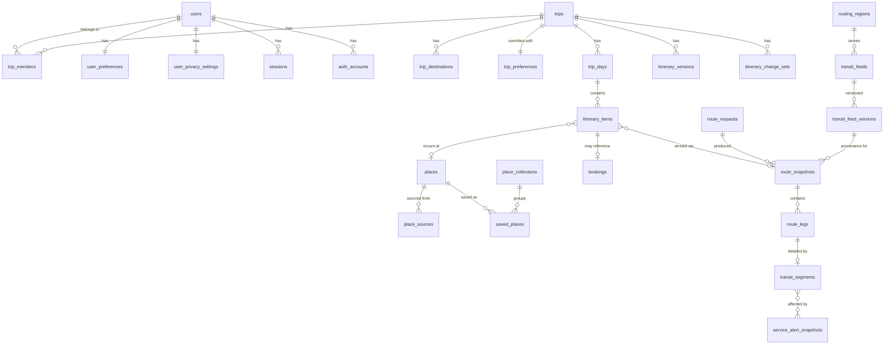
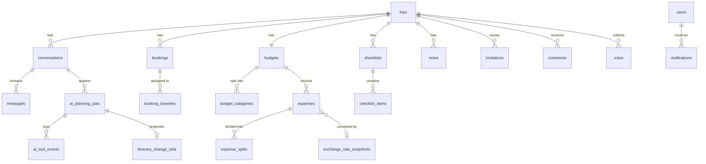

# Data model — ERD and data dictionary

**Status:** Phase 0 · 2026-08-19 · 48 tables

## 1. Conventions (binding)

| Rule | Detail |
| --- | --- |
| Primary keys | UUIDv7, generated in the application (ADR-0015) |
| Instants | `timestamptz`, always UTC |
| Wall-clock intentions | separate `date` + `time` + `iana_zone` alongside the instant (ADR-0007) |
| Money | `numeric(18,4)` + `char(3)` ISO 4217 (ADR-0008). Never `float` |
| Points | `geography(Point,4326)` |
| Lines | `geography(LineString,4326)` |
| Spatial indexes | GiST on every geography column that is queried spatially |
| Audit columns | `created_at`, `updated_at` on every mutable table; `created_by` where an actor exists |
| Soft delete | `deleted_at` **only** where recovery or audit requires it — `trips`, `itinerary_items`, `notes`, `bookings`. Everything else deletes hard |
| Concurrency | `version integer NOT NULL DEFAULT 1` on `trips`, `trip_days`, `itinerary_items`, `budgets` (ADR-0019) |
| Enums | Postgres enum types, so an invalid status cannot be written |
| RLS | Enabled **and forced** on every tenant-scoped table (see `15-DATABASE-STRATEGY.md`) |

## 2. ERD — core planning cluster

## 3. ERD — AI, collaboration, money

## 4. Data dictionary

### 4.1 Identity and account (6 tables)

**`users`** — `id`, `email citext UNIQUE NOT NULL`, `email_verified_at`, `password_hash` (Argon2id),
`display_name`, `home_iana_zone`, `locale`, `unit_system` enum(`METRIC`,`IMPERIAL`), `time_format`
enum(`H12`,`H24`), `default_currency char(3)`, `created_at`, `updated_at`, `deleted_at`.
The hash column is never selected by default repositories.

**`auth_accounts`** — optional OAuth linkage, kept off the default path. `id`, `user_id`,
`provider`, `provider_account_id`, `created_at`. Unique `(provider, provider_account_id)`.

**`sessions`** — `id`, `user_id`, `token_hash` (never the raw token), `expires_at`, `created_at`,
`last_seen_at`, `user_agent_hash`, `ip_hash`. IP and UA are hashed, not stored raw — privacy by
default. Index on `expires_at` for sweeping.

**`verification_tokens`** — `id`, `user_id`, `purpose` enum(`EMAIL_VERIFY`,`PASSWORD_RESET`),
`token_hash`, `expires_at`, `consumed_at`. Single-use enforced by `consumed_at IS NULL` in the
update predicate.

**`user_preferences`** — the reusable profile defaults. Interests and dislikes (`text[]`), `pace`
enum(`RELAXED`,`BALANCED`,`INTENSIVE`,`CUSTOM`), `budget_amount`/`budget_currency`,
`preferred_modes`/`avoided_modes` (`text[]`), `max_walk_meters_per_leg`, `max_walk_meters_per_day`,
`min_transfer_seconds`, `earliest_start time`, `latest_finish time`, `meal_windows jsonb`,
`dietary text[]`, `accessibility jsonb` (including `step_free boolean`), `indoor_outdoor_balance`,
`travelling_with jsonb` (children, elderly, luggage, stroller), `nightlife`, `sustainability`,
`buffer_minutes`, `weather_tolerance`.

**`user_privacy_settings`** — `location_history_enabled`, `analytics_enabled`,
`ai_input_retention` enum(`NONE`,`SESSION`,`RETAINED`), `share_profile_on_shared_trips`,
`export_requested_at`, `deletion_requested_at`.

### 4.2 Trips (4 tables)

**`trips`** — `id`, `owner_id`, `title`, `cover_asset_id`, `status`
enum(`PLANNING`,`UPCOMING`,`ACTIVE`,`PAST`,`ARCHIVED`), `start_date date`, `end_date date`,
`traveler_count`, `tags text[]`, `visibility` enum(`PRIVATE`,`LINK`,`MEMBERS`), `version`,
`created_at`, `updated_at`, `deleted_at`. Check: `end_date >= start_date`.

**`trip_members`** — `trip_id`, `user_id`, `role` enum(`OWNER`,`EDITOR`,`VIEWER`), `joined_at`.
PK `(trip_id, user_id)`. **Partial unique index guarantees exactly one `OWNER` per trip** — an
owner cannot remove themselves into an ownerless trip.

**`trip_destinations`** — `id`, `trip_id`, `name`, `centroid geography(Point,4326)`,
`bbox geography(Polygon,4326)`, `iana_zone`, `arrive_date`, `depart_date`, `ordinal`,
`routing_region_id` (nullable — null means no coverage), `coverage_tier`
enum(`T0`,`T1`,`T2`,`T3`). The tier is **derived and refreshed**, never user-entered.

**`trip_preferences`** — same shape as `user_preferences` with every column nullable. Null means
"inherit from profile". The UI shows which value wins and why, from this exact structure.

### 4.3 Itinerary (4 tables)

**`trip_days`** — `id`, `trip_id`, `local_date date`, `iana_zone`, `ordinal`, `title`, `notes`,
`version`. Unique `(trip_id, local_date)`.

**`itinerary_items`** — the centre of the product.
`id`, `trip_day_id`, `trip_id` (denormalised for RLS and indexing), `kind`
enum(`ACTIVITY`,`MEAL`,`REST`,`LODGING`,`MEETING`,`TRANSPORT`,`FREE_TIME`,`BOOKING`),
`place_id` (nullable), `title`, `notes`,
`start_instant timestamptz`, `end_instant timestamptz`,
`local_start_time time`, `local_end_time time`, `iana_zone`,
`planned_duration_seconds`,
`lock_time boolean`, `lock_place boolean`, `lock_item boolean`,
`inbound_route_snapshot_id` (nullable — the leg that gets you *here*),
`cost_amount numeric(18,4)`, `cost_currency char(3)`, `cost_status DataStatus`,
`booking_id` (nullable), `ordinal`, `version`, `created_at`, `updated_at`, `deleted_at`.

Constraints: `end_instant > start_instant`; `ordinal` unique per day among non-deleted rows;
`lock_item` implies both other locks (check constraint, so an inconsistent lock state is
unrepresentable).

**`itinerary_versions`** — `id`, `trip_id`, `version_number`, `label`, `snapshot jsonb` (the
complete materialised itinerary), `created_by`, `created_at`, `change_set_id` (nullable).
Immutable. Restoring writes a *new* version rather than mutating an old one.

**`itinerary_change_sets`** — `id`, `trip_id`, `origin` enum(`AI`,`USER`,`SYSTEM`), `job_id`,
`status` enum(`PROPOSED`,`PARTIALLY_APPLIED`,`APPLIED`,`REJECTED`,`EXPIRED`),
`changes jsonb` (typed add/remove/move/edit operations, each independently selectable),
`rationale text`, `confidence jsonb`, `unmet_constraints jsonb`, `created_at`, `applied_at`.
Selective application is why `changes` is an array of individually addressable operations rather
than a diff blob.

### 4.4 Places (4 tables)

**`places`** — `id`, `canonical_name`, `coord geography(Point,4326) NOT NULL`, `address jsonb`,
`categories text[]`, `iana_zone`, `opening_hours_raw text`, `opening_hours_confidence`
enum(`FEED`,`PARSED`,`USER`,`UNKNOWN`), `typical_visit_seconds`, `accessibility jsonb`,
`created_at`, `updated_at`. GiST index on `coord`; trigram index on `canonical_name` for the
duplicate check.
**No column exists for ratings, reviews, popularity or price.** Absence is deliberate: a field that
does not exist cannot be populated with an invention.

**`place_sources`** — `id`, `place_id`, `provider` enum(`OSM`,`NOMINATIM`,`WIKIDATA`,`USER`),
`source_id`, `source_url`, `licence`, `attribution`, `raw jsonb`, `retrieved_at`.
Unique `(provider, source_id)` — the primary duplicate-detection mechanism. The secondary is
spatial proximity plus name similarity, run when a source ID is absent.

**`saved_places`** — `id`, `trip_id` (nullable — a place can be saved to the profile),
`user_id`, `place_id`, `collection_id`, `note`, `tags text[]`, `created_at`.

**`place_collections`** — `id`, `owner_id`, `trip_id` (nullable), `name`, `colour`, `ordinal`.

### 4.5 Routing and provenance (5 tables + 3 catalog)

**`route_requests`** — the question asked. `id`, `trip_id`, `origin geography(Point,4326)`,
`destination geography(Point,4326)`, `depart_at`/`arrive_by` (exactly one non-null, enforced by
check), `iana_zone`, `modes text[]`, `preferences jsonb`, `routing_region_id`, `requested_by`,
`requested_at`. Keeping the request separate from the answer is what lets us cache correctly and
explain why two snapshots differ.

**`route_snapshots`** — the immutable answer (ADR-0006). `id`, `route_request_id`,
`status DataStatus NOT NULL`, `total_duration_seconds`, `start_instant`, `end_instant`,
`transfer_count`, `walk_distance_meters`, `geometry geography(LineString,4326)`,
`routing_region_id`, `feed_version_ids uuid[]`, `retrieved_at NOT NULL`, `raw jsonb` (retained only
where licence and retention permit), `created_at`. **No `updated_at`: these rows are never
modified.**

**`route_legs`** — `id`, `route_snapshot_id`, `ordinal`, `kind`
enum(`WALK`,`CYCLE`,`DRIVE`,`TRANSIT`), `distance_meters`, `duration_seconds`,
`start_instant`, `end_instant`, `geometry geography(LineString,4326)`.

**`transit_segments`** — the fields that must never be invented. `id`, `route_leg_id`, `agency`,
`agency_url`, `mode`, `route_short_name`, `route_long_name`, `route_colour`, `headsign`,
`board_stop_name`, `board_stop_code`, `board_platform`, `board_coord`,
`alight_stop_name`, `alight_stop_code`, `alight_platform`, `alight_coord`,
`intermediate_stop_count`, `scheduled_departure`, `scheduled_arrival`,
`realtime_departure`, `realtime_arrival`, `delay_seconds`,
`wheelchair_accessible boolean`, `wheelchair_confidence` enum(`FEED`,`INFERRED`,`UNKNOWN`),
`feed_version_id`.
**Every field except the identifiers and `feed_version_id` is nullable.** Null means the feed did
not supply it and the UI omits the row entirely. This nullability is the schema-level expression of
the non-negotiable truth rules.

**`service_alert_snapshots`** — `id`, `feed_version_id`, `alert_source_id`, `header`, `description`,
`effect`, `cause`, `active_from`, `active_to`, `affected_routes text[]`, `affected_stops text[]`,
`retrieved_at`.

**`routing_regions`** — `id`, `slug`, `display_name`, `otp_router_id`, `bbox geography(Polygon,4326)`,
`graph_built_at`, `osm_extract_url`, `osm_extract_date`, `status`
enum(`ACTIVE`,`BUILDING`,`STALE`,`DISABLED`), `coverage_tier`. GiST on `bbox` — this is the index
that answers "does this destination have coverage".

**`transit_feeds`** — `id`, `routing_region_id`, `agency_name`, `feed_url`,
**`licence text NOT NULL`**, `attribution text NOT NULL`, `terms_url`, `realtime_urls jsonb`,
`requires_api_key boolean`, `licence_verified_at timestamptz NOT NULL`, `notes`.
`licence` is `NOT NULL` with no "unknown" value, so a feed of unknown licence is structurally
un-ingestible (R-05).

**`transit_feed_versions`** — `id`, `transit_feed_id`, `version_label`, `service_start date`,
`service_end date`, `ingested_at`, `checksum`, `validation_report jsonb`,
`last_success_at timestamptz`, `freshness_window_seconds`, `health`
enum(`HEALTHY`,`DEGRADED`,`SILENT`,`EXPIRED`). `last_success_at` + `freshness_window_seconds` is
the pair from which `REALTIME` vs `STALE` is **derived on read** (R-15).

### 4.6 AI (4 tables)

**`conversations`** — `id`, `trip_id`, `created_by`, `title`, `created_at`.

**`messages`** — `id`, `conversation_id`, `role` enum(`USER`,`ASSISTANT`,`SYSTEM`,`TOOL`),
`content jsonb`, `redacted boolean`, `created_at`. Content is stored per the user's
`ai_input_retention` setting; `NONE` stores only structural metadata.

**`ai_planning_jobs`** — `id`, `trip_id`, `conversation_id`, `idempotency_key`, `status`
enum(`QUEUED`,`RUNNING`,`AWAITING_REVIEW`,`APPLIED`,`FAILED`,`CANCELLED`), `stage`
enum matching the ten pipeline stages, `progress jsonb`, `attempt`, `repair_attempts` (max 2),
`error_code`, `started_at`, `finished_at`. Unique `(trip_id, idempotency_key)`.

**`ai_tool_events`** — `id`, `job_id`, `tool_name`, `input jsonb`, `output_summary jsonb`,
`authorized boolean`, `duration_ms`, `created_at`.
This is the table that makes "we checked these sources" truthful: the UI renders which sources were
consulted **from these rows**, so the claim cannot be made unless the call happened.

### 4.7 Bookings, budget, content (10 tables)

**`bookings`** — `id`, `trip_id`, `kind`
enum(`LODGING`,`FLIGHT`,`RAIL`,`BUS`,`EVENT`,`RESTAURANT`,`CAR`,`OTHER`), `provider_name`,
`confirmation_ref_encrypted bytea`, `start_instant`, `end_instant`, `local_start`, `local_end`,
`iana_zone`, `place_id`, `cost_amount`, `cost_currency`, `link_url`, `notes`, `version`,
`created_at`, `deleted_at`.
**No payment-card columns exist. No identity-document columns exist.** Confirmation references are
encrypted at the application layer.

**`booking_travelers`** — `booking_id`, `user_id` or `traveler_label`, `created_at`.

**`budgets`** — `id`, `trip_id`, `total_amount`, `currency`, `version`.

**`budget_categories`** — `id`, `budget_id`, `name`, `planned_amount`, `currency`, `ordinal`.

**`expenses`** — `id`, `trip_id`, `budget_category_id`, `description`, `amount`, `currency`,
`incurred_on date`, `paid_by`, `exchange_rate_snapshot_id`, `created_at`.

**`expense_splits`** — `id`, `expense_id`, `user_id` or `traveler_label`, `share_amount`,
`currency`. Splits are computed in integer minor units so they sum exactly to the total; a
constraint asserts the sum matches (ADR-0008).

**`exchange_rate_snapshots`** — `id`, `base_currency`, `quote_currency`, `rate numeric(18,8)`,
`rate_date date`, `source` enum(`MANUAL`,`PROVIDER`), `source_name`, `retrieved_at`.
`MANUAL` is never rendered as live.

**`checklists`** / **`checklist_items`** — `id`, `trip_id`, `title`, `ordinal`; items add
`is_done`, `assigned_to`, `due_date`, `quantity`.

**`notes`** — `id`, `trip_id`, `author_id`, `title`, `body_richtext jsonb` (sanitised on write and
again on render), `pinned`, `created_at`, `updated_at`, `deleted_at`.

### 4.8 Collaboration (4 tables)

**`invitations`** — `id`, `trip_id`, `email citext`, `role`, `token_hash`, `status`
enum(`PENDING`,`ACCEPTED`,`REVOKED`,`EXPIRED`), `invited_by`, `expires_at`, `idempotency_key`.
Invitation is by **exact** email — no discovery or enumeration of users.

**`comments`** — `id`, `trip_id`, `target_type`, `target_id`, `author_id`, `body`, `created_at`,
`deleted_at`. (Phase 7.)

**`votes`** — `id`, `trip_id`, `target_type`, `target_id`, `user_id`, `value smallint`.
Unique `(target_type, target_id, user_id)`. (Phase 7.)

**`notifications`** — `id`, `user_id`, `kind`, `payload jsonb`, `read_at`, `created_at`.

### 4.9 Infrastructure (4 tables)

**`provider_cache_entries`** — `id`, `provider`, `cache_key text`, `response jsonb`,
`retrieved_at`, `expires_at`, `hit_count`. Unique on `(provider, cache_key)`.
Satisfies the Nominatim caching requirement (ADR-0011).

**`provider_rate_limit_state`** — `provider text PRIMARY KEY`, `tokens numeric`,
`last_refill_at timestamptz`, `window_seconds`.
Deliberately a **single row per provider**, updated with `SELECT … FOR UPDATE`, so the 1 req/s
Nominatim limit holds across every process and instance. A per-process limiter would breach the
policy as soon as we run two containers.

**`audit_events`** — `id`, `actor_id`, `trip_id`, `action`, `target_type`, `target_id`,
`metadata jsonb`, `correlation_id`, `created_at`. Append-only; no update or delete grant.
Never contains secrets, tokens, full prompts or precise private coordinates.

**`outbox_events`** — `id`, `aggregate_type`, `aggregate_id`, `event_type`, `payload jsonb`,
`published_at`, `attempts`, `created_at`. Written in the same transaction as the state change it
describes; drained by the worker.

## 5. Indexing plan (from real query patterns)

| Query | Index |
| --- | --- |
| Trip home by user and status | `trip_members(user_id)` + `trips(status, start_date)` |
| Day timeline | `itinerary_items(trip_day_id, ordinal) WHERE deleted_at IS NULL` |
| Impacted-leg recalculation | `itinerary_items(trip_id, start_instant)` |
| Places near a point | GiST on `places(coord)` |
| Duplicate detection | GiST on `places(coord)` + trigram on `canonical_name` + unique `place_sources(provider, source_id)` |
| Coverage lookup for a destination | GiST on `routing_regions(bbox)` |
| Route cache lookup | `route_requests(routing_region_id, origin, destination, depart_at)` |
| Snapshot freshness | `route_snapshots(retrieved_at)` |
| Feed health | `transit_feed_versions(transit_feed_id, last_success_at)` |
| Job polling | `ai_planning_jobs(status, started_at)` |
| Audit lookup | `audit_events(trip_id, created_at DESC)`, `audit_events(correlation_id)` |
| Outbox drain | `outbox_events(published_at) WHERE published_at IS NULL` |

## 6. Retention

| Data | Retention | Why |
| --- | --- | --- |
| `route_snapshots` unreferenced by a live version | 90 days, then purge | Grows unboundedly by design (ADR-0006) |
| `provider_cache_entries` | Per-provider TTL, swept daily | Provider policy compliance |
| `messages` | Per user's `ai_input_retention` | Privacy setting must have teeth |
| `sessions` | Purged after expiry | — |
| `audit_events` | 24 months | Investigation window |
| `itinerary_versions` | Retained for the trip's life | Restore is a product feature |
| `service_alert_snapshots` | 30 days past `active_to` | Historical value decays fast |
